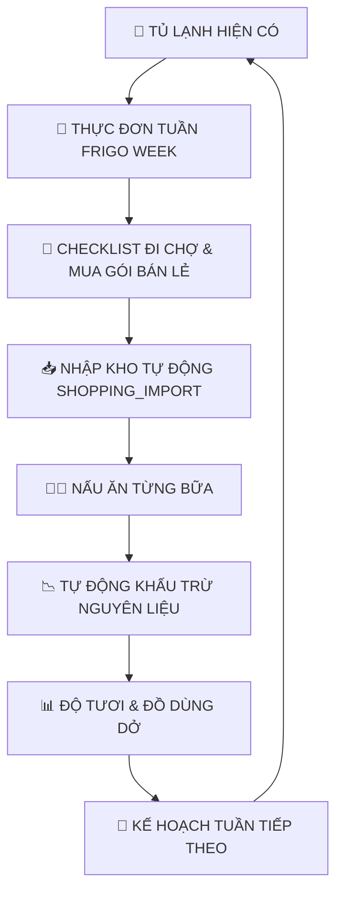

# Frigo 🥗
> **"Mở tủ lạnh. Biết ngay hôm nay ăn gì."**  
> Smarter food for a brighter tomorrow. Less food waste. More great meals.

[](https://github.com/tungjpstore/frigo/actions)
[](LICENSE)
[](https://frigo.tungjpstore.net)

---

## 1. Giới thiệu Frigo

**Frigo** là ứng dụng AI thông minh giúp người dùng quản lý thực phẩm trong tủ lạnh, nhận diện nguyên liệu qua ảnh chụp camera, tự động theo dõi hạn dùng/độ tươi, và đưa ra gợi ý món ăn tối ưu từ thực phẩm sẵn có.

Frigo **KHÔNG** phải là một chatbot công thức chung chung (generic recipe bot). Frigo xây dựng xung quanh vòng lặp thực phẩm khép kín hoàn chỉnh (Closed Product Loop):



### Triết lý "Ăn đủ. Mua đủ. Dùng hết."
* **Ăn đủ:** Định lượng calo, nhóm chất và khẩu phần gia đình tự động co giãn (`portion scaling`).
* **Mua đủ:** Tính toán kích thước gói hàng bán lẻ (retail pack sizing: 500g, 1kg, 1L, vỉ 6/10 trứng) và chỉ mua phần thực sự thiếu sau khi đã trừ triệt để tồn kho tủ lạnh (`net shopping subtraction`).
* **Dùng hết:** Ưu tiên nguyên liệu sắp hết hạn, gom đồ thừa (`leftover allocation`) và tối đa hóa tỷ lệ tận dụng thực phẩm (`Fridge Utilization`).

### North Star Metrics
* **Chỉ số sản phẩm chính (North Star):** `completed meals per active household per week` (Số bữa ăn nấu thành công trên mỗi hộ gia đình hoạt động mỗi tuần).
* **Chỉ số thứ cấp (Secondary):** `Scan → Cook Conversion Rate` & `Weekly Food Utilization Rate` (% thực phẩm mua về được tiêu thụ, giảm thiểu rác thải thực phẩm).

---

## 2. Nhận diện thương hiệu & Thiết kế

Theo quy chuẩn Brand Identity của Frigo:
* **Fresh Green (Chính):** `#22C55E` - Năng động, tươi mới, đại diện cho thực phẩm sạch.
* **Deep Green (Chữ & Nền nhấn):** `#0F3D2E` - Chiều sâu, đáng tin cậy.
* **Mint (Nền phụ & Card):** `#DDF7E3` - Nhẹ nhàng, dịu mắt.
* **Cream (Nền chính):** `#FFFDF6` - Ấm cúng, tự nhiên như gian bếp gia đình.
* **Tomato Red (Cảnh báo hết hạn):** `#EF4444`
* **Sunny Yellow (Dùng sớm & Plus):** `#FACC15`
* **Typography:** Tiêu đề dùng font bo tròn thân thiện (Poppins Rounded), nội dung dùng Inter.
* **Giao diện:** Mobile-first (360px - 430px), bo góc tròn mềm mại `16–24px`, chiều cao nút bấm `48–56px`, vùng chạm `≥ 44px`.

---

## 3. Kiến trúc kỹ thuật & Tech Stack

Dự án tuân thủ phân tách nghiêm ngặt giữa **UI**, **API Worker**, **Domain Logic**, **AI Layer** và **Database Layer**:

* **Frontend:** React 18, TypeScript, Vite, Tailwind CSS, TanStack Query v5, Zustand, React Router v6, Lucide Icons, PWA.
* **Backend:** Cloudflare Workers, Hono, TypeScript.
* **Cloudflare Services:**
  * **D1:** Relational SQL Database (25 bảng chuẩn hóa, foreign key, index).
  * **R2:** Lưu trữ ảnh chụp tủ lạnh (`users/{userId}/scans/{scanId}/original.webp`).
  * **KV:** Cache công thức, danh mục ẩm thực, canonical ingredients.
  * **Queues:** Hàng đợi xử lý ảnh AI Vision nền (`frigo-scan-queue`).
  * **Turnstile:** Chuẩn bị sẵn cơ chế chống bot và rate-limiting.
* **AI Architecture:**
  * Lớp trừu tượng `AIRouter` (không gọi trực tiếp SDK trong business logic).
  * **Primary AI (vision, receipt OCR, chat, ranking):** Qwen `qwen3.7-flash` qua DashScope international endpoint (`QWEN_BASE_URL`, `QWEN_MODEL`). Thinking được tắt cho các request có cấu trúc để giảm độ trễ.
  * **Fallback paths:** Qwen luôn được thử trước; Groq chỉ được thêm khi `GROQ_FALLBACK_ENABLED=true`, Cloudflare Vision chỉ khi `CLOUDFLARE_VISION_FALLBACK=true`, rồi mới đến các adapter GLM/DeepSeek đã được bật rõ ràng.
  * **Extension providers:** DeepSeek giữ vai trò fallback cho text/ranking khi `DEEPSEEK_FALLBACK_ENABLED=true`; Z.ai/GLM giữ adapter vision/text khi `GLM_FALLBACK_ENABLED=true`. Có thể nâng model GLM (ví dụ GLM-5.3 Flash) ở một thay đổi cấu hình/adapter riêng, không tự động bật trong production.
  * **Fallback Mock Mode:** Tích hợp `AI_MOCK_MODE=true` giả lập kết quả thực tế cho kiểm thử local mà không cần API key ngoài.
  * **Strict Structured Output:** JSON được kiểm duyệt qua Zod và quality gate; nhãn placeholder hoặc confidence dưới `0.6` không được tạo bản nháp. Lỗi provider được phân loại để queue chỉ retry lỗi tạm thời; production không dùng mock để che lỗi.
* **Testing & Quality:** Vitest (Unit test scoring engine, AI schemas), strict TypeScript, ESLint, Prettier.

---

## 4. Cấu trúc thư mục (Repository Structure)

```text
frigo/
├── src/
│   ├── web/                          # Frontend React SPA
│   │   ├── components/               # Reusable UI components & layouts
│   │   ├── pages/                    # 17 MVP screens
│   │   ├── services/                 # API client kết nối Worker & local fallback
│   │   ├── stores/                   # Zustand stores (Auth, Scan, Cooking)
│   │   └── styles/                   # Tailwind & brand theme
│   │
│   ├── worker/                       # Cloudflare Workers Backend
│   │   ├── index.ts                  # Hono entrypoint & queue consumers
│   │   ├── middleware/               # Auth (Guest & JWT), error handling
│   │   ├── routes/                   # REST API routes (/api/v1/*, bao gồm /week/*)
│   │   └── types.ts                  # Env bindings (DB, IMAGES, CACHE, QUEUE)
│   │
│   └── shared/                       # Chia sẻ giữa Web & Worker
│
├── packages/                         # Monorepo packages
│   ├── db/                           # D1 database types & query helpers
│   ├── domain/                       # Canonical ingredient model, units, event sourcing & week planner engine
│   ├── recipes/                      # Seed dataset 70+ món & deterministic score engine
│   └── ai/                           # AI Router (Qwen, GLM, DeepSeek, Mock)
│
├── migrations/                       # D1 Database SQL Migrations
│   ├── 0001_initial_schema.sql       # Schema 25 bảng D1
│   ├── 0002_seed_data.sql            # Seed dữ liệu demo tủ lạnh & công thức
│   └── 0003_weekly_planner.sql       # Schema 10 bảng kế hoạch tuần Frigo Week
│
├── tests/                            # Vitest unit tests (scoring engine, AI schemas, week planner)
├── public/                           # Vector SVG logo, PWA icons, assets minh họa
├── wrangler.jsonc                    # Cloudflare Worker & bindings configuration
├── vite.config.ts                    # Vite build config
├── tsconfig.json                     # TypeScript strict configuration
└── package.json
```

---

## 5. Hướng dẫn chạy Local Development

### Yêu cầu hệ thống
* Node.js >= 20
* pnpm >= 9

### Bước 1: Clone và Cài đặt
```bash
git clone https://github.com/tungjpstore/frigo.git
cd frigo
pnpm install
```

### Bước 2: Cấu hình biến môi trường
Tạo file `.dev.vars` từ file mẫu:
```bash
cp .dev.vars.example .dev.vars
```
Mặc định `AI_MOCK_MODE=true` đã được kích hoạt sẵn để bạn có thể test đầy đủ toàn bộ luồng chụp ảnh, gợi ý món ăn và trừ nguyên liệu ngay trên máy mà không cần nhập API key.

### Bước 3: Chạy ứng dụng
Mở terminal và chạy giao diện web:
```bash
pnpm dev
```
Truy cập trình duyệt tại: **http://localhost:5173**

Nếu muốn chạy kèm Cloudflare Worker local mode:
```bash
pnpm dev:worker
```

---

## 6. Kiểm thử & Đảm bảo chất lượng

Dự án trang bị bộ lệnh kiểm tra tự động toàn diện:

```bash
# Chạy Unit Tests bằng Vitest
pnpm test

# Chạy Typecheck kiểm tra lỗi TypeScript nghiêm ngặt (cả Web và Worker)
pnpm typecheck

# Chạy ESLint
pnpm lint

# Kiểm tra và định dạng mã nguồn bằng Prettier
pnpm format

# Kiểm tra toàn diện 4 bước tự động trước khi deploy (Typecheck + Lint + Test + Build)
pnpm check

# Chạy Build production hoàn chỉnh
pnpm build
```

---

## 7. Thiết lập Cloudflare Production & Custom Domain

Để deploy lên tên miền chính thức **https://frigo.tungjpstore.net**:

### Bước 1: Tạo tài nguyên Cloudflare
Chạy các lệnh Wrangler sau:
```bash
# 1. Tạo D1 Database
pnpm wrangler d1 create frigo-db
# Copy ID vừa tạo và cập nhật vào wrangler.jsonc

# 2. Tạo R2 Bucket lưu ảnh
pnpm wrangler r2 bucket create frigo-images

# 3. Tạo KV Namespace làm cache
pnpm wrangler kv:namespace create frigo-cache

# 4. Tạo Cloudflare Queue
pnpm wrangler queues create frigo-scan-queue
```

### Bước 2: Áp dụng Migrations D1
```bash
# Read-only release gate; both targets must pass before rollout
pnpm schema:check:local
pnpm schema:check:remote

# Local (applies all pending migrations in order)
pnpm wrangler d1 migrations apply frigo-db --local

# Production (run only after schema preflight and backup/export)
pnpm wrangler d1 migrations apply frigo-db --remote
```

Do not replay individual migration files with `d1 execute` in an environment that
already tracks migration history; use `migrations apply` so Wrangler records the
applied version and prevents accidental reordering.

The repository migration chain currently covers `0001` through `0023`. The recorded
production receipt is at `0022` until the OCR recovery migration is explicitly
applied during a guarded release. Migration `0006`
was hardened to use UPSERT-style seed writes so replay does not wipe
`favorites` or `recipe_translations` rows that reference seeded recipes.
Migration `0010` is additive: it backfills richer Week shadow tables while
leaving the legacy projections intact until a separately verified cutover.
Migration `0011` makes meal-plan household ownership immutable so a concurrent
cross-tenant `planId` collision aborts the complete D1 batch.
Migration `0012` adds the durable scan queue ledger used by the queue consumer
for idempotency, leases, retries, and permanent failure tracking.
Migration `0013` adds receipt metadata and unit/total prices for asynchronous
receipt review. Migration `0023` adds scan request fingerprints and MIME metadata
so idempotent replays cannot substitute a different image payload.
`SCAN_QUEUE_MODE` is `async` in production only after provider smoke validation;
set it to `sync` as a rollback switch if queue health degrades. Confirm the
queue/DLQ and AI provider health checks before enabling async again.
See `docs/D1_SCHEMA_GATE.md` for gate behavior and failure handling.

### Bước 3: Thiết lập Secret Production
```bash
pnpm wrangler secret put QWEN_API_KEY
pnpm wrangler secret put ZAI_API_KEY
pnpm wrangler secret put DEEPSEEK_API_KEY
pnpm wrangler secret put TURNSTILE_SECRET_KEY
# Optional legacy fallback only; keep disabled while Qwen is configured.
pnpm wrangler secret put GROQ_API_KEY
```

Model/route vars are non-secret configuration:
`QWEN_BASE_URL=https://dashscope-intl.aliyuncs.com/compatible-mode/v1`,
`QWEN_MODEL=qwen3.7-flash`, `GROQ_FALLBACK_ENABLED=false`,
`CLOUDFLARE_VISION_FALLBACK=false`, `GLM_FALLBACK_ENABLED=false`, and
`DEEPSEEK_FALLBACK_ENABLED=false`. Groq remains an optional legacy fallback;
do not enable it merely by storing `GROQ_API_KEY`. Run a non-PII provider smoke
and the guarded workflow in `DEPLOYMENT.md` before representing candidate
settings as production state.

### Bước 4: Deploy
```bash
pnpm build
pnpm wrangler deploy
```

Workers Logs được khai báo trong `wrangler.jsonc` với invocation logging,
persistence và sampling 100%. Sau deploy, kiểm tra version nhận 100% traffic,
`/api/v1/health`, các route public/auth guard và D1 migration history trên
Cloudflare Dashboard trước khi coi rollout hoàn tất.

Chạy release gate có xác minh D1 production bằng:

```bash
CHECK_REMOTE_SCHEMA=1 pnpm check
```

Trước khi bật Week dual-write, yêu cầu thêm strict parity gate:

```bash
CHECK_REMOTE_SCHEMA=1 CHECK_WEEK_PARITY_REMOTE=1 pnpm check
```

Xem `docs/WEEK_RECONCILIATION.md` để đọc report checksum, orphan rows và
projection issues. Không bật `dual` nếu gate này chưa xanh.

---

## 8. Frigo Week — Thực đơn tuần ("Ăn đủ. Mua đủ. Dùng hết.")

Frigo Week là hệ thống lập kế hoạch thực đơn tuần thông minh khép kín vòng lặp thực phẩm gia đình.

### Nguyên tắc kiến trúc cốt lõi:
> **"AI KHÔNG BAO GIỜ làm phép tính toán học."**  
> Toàn bộ tính toán định lượng (portion scaling), kiểm tra ngân sách, quy đổi kích cỡ đóng gói bán lẻ (package sizing), khấu trừ tồn kho tủ lạnh và phân bổ đồ thừa đều được thực thi **100% bằng TypeScript Domain Logic tất định** (`packages/domain/src/week/`).  
> Mô hình ngôn ngữ lớn (LLM qua `AIRouter`) chỉ đóng vai trò phân tích khẩu vị, giải thích lý do gợi ý hoặc xếp hạng văn phong.

### Các thành phần Domain Engine:
1. **Multi-Slot Planner (`planner.ts`):** Hỗ trợ lập kế hoạch cho 7 ngày trong tuần với các bữa Sáng, Trưa, Tối, Ăn xế, Meal prep, Nấu sẵn chia 2 bữa (`leftover cook`), Ăn đồ thừa (`leftover eat`), Ăn ngoài (`eat out`), hoặc Nhịn ăn gián đoạn (`fasting`).
2. **Deterministic Portion Scaling (`portion.ts`):** Tự động co giãn định lượng nguyên liệu theo số người trong hộ gia đình (1, 2, 4, 6+ người).
3. **9-Factor Evaluation Engine (`score.ts`):** Tính điểm ứng viên dựa trên: tỷ lệ nguyên liệu có sẵn, đồ sắp hết hạn, ngân sách, thời gian nấu, mức độ yêu thích ẩm thực, độ cay, đa dạng nguồn đạm trong tuần (tránh trùng đạm liên tiếp), và mức độ phức tạp.
4. **Inventory Subtraction (Requirement 59 - `shopping.ts`):**
   $$\text{Nhu cầu mua ròng} = \max(0, \text{Tổng nhu cầu công thức cả tuần} - \text{Tồn kho tủ lạnh hiện có})$$
5. **Retail Package Recommendation (`packages.ts`):** Tự động làm tròn số lượng cần mua lên các gói bán lẻ phổ biến tại siêu thị/chợ Việt Nam (500g, 1kg, 1L, vỉ 6/10 trứng) và tính trước lượng nguyên liệu thừa dự kiến để tái sử dụng tuần sau.
6. **Smart Meal Swap (`planner.ts`):** Cho phép đổi món ăn bất kỳ trong tuần mà không làm xáo trộn các ngày còn lại; cung cấp danh sách món thay thế kèm theo chênh lệch ngân sách ($\Delta$ Cost), thời gian chuẩn bị và mức độ tận dụng đồ trong tủ lạnh ($\Delta$ Utilization).
7. **Closed-loop Shopping List & Import (`shopping.ts`):** Phân nhóm nguyên liệu đi chợ theo 7 khu vực thực tế (Rau củ quả, Thịt - Hải sản, Trứng - Sữa, Gia vị - Dầu ăn, Gạo - Mì khô, Đồ đông lạnh, Khác). Khi bấm hoàn tất đi chợ, hệ thống tự động nhập kho tủ lạnh qua sự kiện `SHOPPING_IMPORT`.

### Bảng dữ liệu D1 (`migrations/0003_weekly_planner.sql`):
* `meal_plans`, `meal_plan_days`, `meal_slots`, `meal_plan_ingredient_requirements`
* `shopping_runs`, `shopping_run_items`
* `weekly_planner_preferences`, `pantry_staples`
* `ingredient_prices`, `ingredient_package_sizes`

### Hệ thống API Cloudflare Worker:
* `GET /api/v1/week/current` — Lấy kế hoạch tuần hiện tại của hộ gia đình
* `GET /api/v1/week/plans` & `POST /api/v1/week/plans` — Danh sách & Tạo kế hoạch tuần
* `GET /api/v1/week/plans/:id` — Chi tiết kế hoạch kèm chỉ số ngân sách & độ tận dụng
* `POST /api/v1/week/plans/:id/generate` — Sinh thực đơn 7 ngày tự động
* `GET /api/v1/week/plans/:id/meals/:mealId/swap` — Gợi ý món thay thế kèm delta chi phí/thời gian
* `POST /api/v1/week/plans/:id/meals/:mealId/swap` — Thực hiện hoán đổi món
* `GET /api/v1/week/plans/:id/meals/:mealId` — Chi tiết bữa ăn & đối chiếu có sẵn / cần mua
* `GET /api/v1/week/plans/:id/shopping` — Checklist đi chợ theo 7 khu vực
* `POST /api/v1/week/plans/:id/shopping/complete` — Hoàn tất đi chợ và tự động nhập kho tủ lạnh
* `GET /api/v1/week/preferences` & `POST /api/v1/week/preferences` — Cấu hình sở thích tuần

---

## 9. Nguyên tắc Bảo mật & Quyền riêng tư (Privacy-by-Design)

* **Không chia sẻ thông tin cá nhân:** Khi gửi ảnh sang các mô hình AI Vision (Groq/Qwen, Cloudflare hoặc GLM), API chỉ chuyển đổi ảnh sau khi đã loại bỏ toàn bộ dữ liệu EXIF và GPS. Tuyệt đối không đính kèm email, họ tên, số điện thoại hay thông tin định danh của người dùng.
* **Xác thực trước khi lưu:** Dữ liệu nhận diện từ AI luôn được đưa về trạng thái bản nháp (`Draft`). Người dùng có toàn quyền kiểm tra, chỉnh sửa số lượng, đơn vị, hoặc xóa bỏ trước khi cập nhật vào kho thực phẩm.
* **Quality gate và fail-closed:** Kết quả không có dòng thực phẩm đủ tin cậy (`AI_SCAN_NO_USABLE_ITEMS`) hoặc lỗi provider vĩnh viễn không được biến thành dữ liệu tồn kho giả; queue chỉ retry lỗi tạm thời.
* **Event Sourcing:** Mọi thao tác thêm bớt nguyên liệu đều lưu vết thành sự kiện (`ADD`, `COOK`, `DISCARD`, `SCAN_CONFIRM`, `SHOPPING_IMPORT`) giúp việc kiểm toán và hoàn tác minh bạch.

---

## 10. Định hướng phát triển tiếp theo (Roadmap)

- [x] MVP Core: Scan tủ lạnh AI, quản lý nguyên liệu, độ tươi, lọc "Không mua thêm gì", Chế độ nấu từng bước, Tự động trừ nguyên liệu, Shopping List.
- [x] Frigo Week: Thực đơn tuần đa bữa, thuật toán khớp tất định, khấu trừ tồn kho tủ lạnh, định lượng gói bán lẻ, tráo món thông minh, checklist đi chợ 7 khu vực, nhập kho tự động.
- [x] Nhận diện hóa đơn siêu thị (Receipt OCR to Inventory / Reconcile Shopping List).
- [x] Trợ lý đầu bếp giọng nói tiếng Việt rảnh tay & âm thanh Web Audio (AI Voice Sous Chef).
- [x] Live Camera Viewfinder với điều khiển đèn Flash/Torch và hiệu ứng laser quét.
- [x] Cổng thanh toán Frigo Plus qua VietQR Napas 24/7 tự động kích hoạt.
- [x] Mở rộng kho 32+ công thức nấu ăn chuẩn Việt & Quốc tế kèm định lượng dinh dưỡng calo/macro.
- [x] Chia sẻ tủ lạnh gia đình qua mã mời / QR & xuất thực đơn tuần sang Zalo/Messenger.
