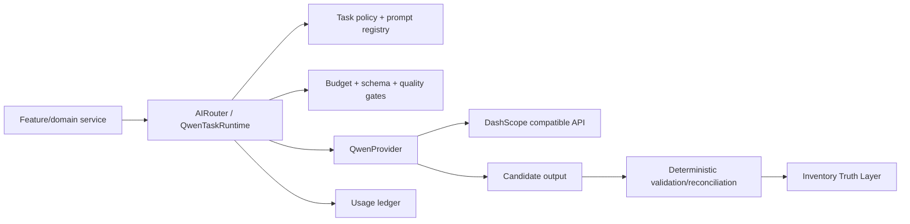

# Qwen Runtime and Model Governance

## Scope

The Worker production composition uses `AIRouter` with `AI_QWEN_ONLY=true`.
Feature services submit a semantic task to the runtime; they do not select a
physical model or provider. The runtime is fetch-based and Cloudflare Workers
compatible.

## Routing matrix

| Task | Logical role | Default physical model | Escalation | Attempts |
| --- | --- | --- | --- | ---: |
| `ingredient_normalization` | `QWEN_FAST` | `qwen3.7-flash-2026-07-15` | none | 2 |
| `recipe_generation` | `QWEN_FAST` | `qwen3.7-flash-2026-07-15` | `QWEN_MULTIMODAL` | 3 |
| `recipe_explanation` | `QWEN_FAST` | `qwen3.7-flash-2026-07-15` | none | 2 |
| `recipe_ranking` | `QWEN_FAST` | `qwen3.7-flash-2026-07-15` | none | 2 |
| `fridge_chat` | `QWEN_FAST` | `qwen3.7-flash-2026-07-15` | none | 2 |
| `receipt_ocr` / `label_ocr` | `QWEN_OCR` | `qwen-vl-ocr` | `QWEN_MULTIMODAL` | 3 |
| `fridge_image_analysis` | `QWEN_MULTIMODAL` | `qwen3.8-flash` | `QWEN_REASONING` (off by default) | 3 |
| `weekly_plan` | `QWEN_FAST` | `qwen3.7-flash-2026-07-15` | `QWEN_MULTIMODAL` | 3 |
| `weekly_plan_repair` | `QWEN_FAST` | `qwen3.7-flash-2026-07-15` | `QWEN_MULTIMODAL` | 3 |
| `weekly_plan_complex` | `QWEN_MULTIMODAL` | `qwen3.8-flash` | `QWEN_REASONING` (off by default) | 3 |
| `offline_evaluation` | `QWEN_JUDGE` | `qwen3.8-max-0902` | none | 1 |

The rolling `qwen3.7-flash` alias is exposed only as
`QWEN_FAST_CANARY`; shadow traffic is disabled by default.

## Safety and cost controls

- `AI_ENABLED` is a global kill switch; production requires it to be true.
- `AI_QWEN_ONLY=true` prevents Groq, DeepSeek, GLM and native Cloudflare AI
  from being constructed by the production router.
- Reasoning and judge roles require `AI_ALLOW_REASONING_MODEL=true` or
  `AI_ALLOW_JUDGE_MODEL=true`; both default to false.
- Every task has a maximum input/output budget. The operation ceiling is
  `AI_MAX_TOTAL_TOKENS` and the call ceiling is `AI_MAX_CALLS_PER_OPERATION`.
- A failed structured response gets one bounded repair attempt and, where the
  policy allows, one escalation. There is no unbounded retry loop.
- Provider usage is recorded without prompts, images, API keys or receipt text;
  the ledger aggregates calls, tokens, estimated cost, latency, failures,
  retries, escalations, OCR failures and planner repairs.
- Model capability metadata controls optional provider parameters. The rolling
  `qwen-vl-ocr` alias is `pinned=false`, does not receive `response_format` or
  `enable_thinking`, and still must pass application JSON parsing, normalization,
  Zod validation and quality gates. Supported multimodal Qwen models retain
  provider JSON mode.
- Vision payloads use `AI_MAX_IMAGE_BYTES` and `AI_MAX_OCR_IMAGE_BYTES` (5 MiB
  defaults, bounded 64 KiB-20 MiB). Raw/data URL base64 is checked by decoded
  byte estimate before inference; remote URLs are intentionally unknown here and
  rely on upstream upload/storage limits.
- Shadow canary is disabled by default. If enabled, it counts against operation
  budgets and is scheduled through an optional host `backgroundExecutor`; Worker
  HTTP routes use `ExecutionContext.waitUntil`, while queue processing skips it
  when no executor is available. Scheduler invocation failures are isolated from
  successful primary responses.

Prices are estimates held in `model-governance.ts`, versioned in telemetry and
overrideable with `AI_PRICE_*` variables. They are not a billing source of
truth.

## OCR and inventory boundary

Receipt and label tasks extract raw lines through `QWEN_OCR`; normalization and
canonical lookup remain separate. Fridge images produce provisional candidates
with confidence and evidence. The quality gate rejects generic labels,
unsupported values and low-confidence rows.

AI output never writes authoritative inventory. The existing flow remains:

`image/text -> candidate -> normalization -> validation -> confidence/review ->
existing reconciliation and fenced inventory command`.

Quantities, unit conversion, expiry ordering, prices, budget arithmetic and
duplicate detection stay deterministic.

This candidate does not claim final T08-T12 Inventory Truth integration: that
lineage remains in the separate `frigo-dev` development repository. After the
later repository unification, the complete AI -> Inventory Observation ->
Reconciliation -> Inventory Truth path must be recertified. This branch only
guarantees that its Qwen runtime has no authoritative inventory mutation path.

## Configuration

The safe production values are versioned in `wrangler.jsonc`; local and staging
templates mirror the names without secrets. `QWEN_API_KEY` is a Worker secret
only and must never be committed or exposed to the browser.

## Evaluation and promotion

Offline fixtures in `tests/fixtures/ai-golden.json` cover Vietnamese, Japanese
and English extraction and
planner cases, including malformed output and low confidence. A future model
promotion requires a golden-dataset comparison of quality, schema success,
latency, token usage and estimated cost, followed by an explicit config change
and normal review/deploy process. No live benchmark is run by CI.

Run `pnpm ai:eval -- --dry-run` to inspect the fixture manifest. The command is
deliberately offline and never consumes Alibaba quota; a live benchmark needs a
separately reviewed server-side harness and explicit credentials.

This governance change is implemented on the feature branch only; it does not
modify canonical `main` or deploy production.

## Pre-unification hardening receipt (2026-09-13)

Application implementation/publication SHA:
`f8468eaa7d7fed3cbcf5ac7e780eca07ad3d71e4`. The remote branch verification
passed before this documentation checkpoint; no force push was used.

The targeted OCR capability, Singapore pricing, shadow lifecycle and vision
budget hardening is implemented without changing routing taxonomy, retry limits,
Qwen-only fail-closed composition or inventory mutation boundaries. Focused
regressions pass **133 tests / 8 files** and full `pnpm check` passes **1,622
tests / 95 files** with lint, typecheck, migration replay and production build.
Offline `pnpm ai:eval -- --dry-run` and `git diff --check` pass. `pnpm audit
--prod` remains a known failure with two moderate React Router advisories;
upgrading React Router is separate follow-up work. No live benchmark, merge,
remote migration, secret update or deployment occurred. T08-T12 Inventory Truth
remains pending U01/U02. After publication, verify the branch SHA and request
review before any benchmark or release.
